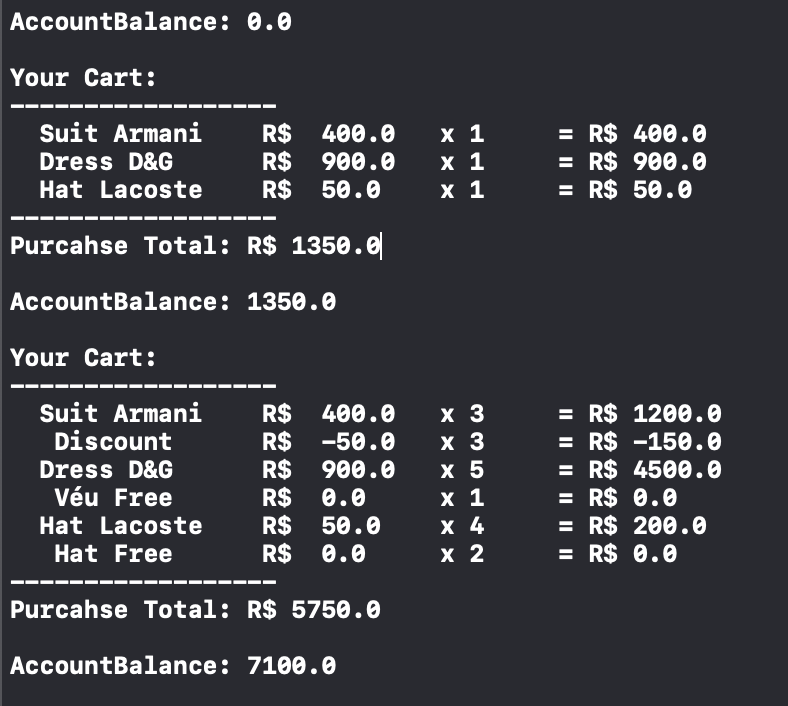

# POO - Encapsulation using Swift

[](https://developer.apple.com/xcode/)
[](https://swift.org)
[](https://img.shields.io/badge/build-passing-green)
[](LICENSE)
&nbsp; &nbsp; &nbsp; &nbsp; &nbsp; &nbsp; &nbsp; &nbsp; &nbsp; &nbsp; &nbsp; &nbsp; &nbsp; &nbsp; &nbsp; &nbsp; &nbsp; &nbsp; &nbsp;&nbsp; &nbsp; &nbsp;
&nbsp; &nbsp; &nbsp; &nbsp; &nbsp; &nbsp; &nbsp; &nbsp; &nbsp; &nbsp; &nbsp; &nbsp; &nbsp; &nbsp; &nbsp; &nbsp; [](https://twitter.com/mpassosferreira)
[](https://www.linkedin.com/in/marciopassosferreira/)
[](mailto:marciopas@gmail.com)


<p align="center">
  <p align="center">
This is a simples example of encapsulation concept.
    <br />
    <br />
    <a href="https://github.com/mpassosferreira/KidsMakeMath/issues">Report Bug</a>
    ·
    <a href="https://github.com/mpassosferreira/KidsMakeMath/issues">Request Feature</a>
    <br />
    <br />
    
  </p>
 </p>
  
### About 

Encapsulation means binding object state(fields) and behaviour(methods) together. The whole idea behind encapsulation is to hide the implementation details from users. If a data member is private it means it can only be accessed within the same class. This example was coded to practice the concept using Swift language.

### Requirements

1.  Xcode 11.7

### Downloading and Running

1.  Clone the repo
```sh
git clone https://github.com/mpassosferreira/swift-bootcamp.git
```
2. Open folder \poo-encapsulation and double-click the file encapsulation.playground.

3. Run all the code, you should get a result equal to the image above.

### Contributing

Contributions are what make the open source community such an amazing place to learn, inspire and create. Any contributions you make are **greatly appreciated**.

1. Fork the Project
2. Create your Feature Branch (`git checkout -b feature/AmazingFeature`)
3. Commit your Changes (`git commit -m 'Add some AmazingFeature'`)
4. Push to the Branch (`git push origin feature/AmazingFeature`)
5. Open a Pull Request

### License

Distributed under the MIT License. See `LICENSE` for more information.
 
 
[Twitter URL]: https://twitter.com/mpassosferreira
[linkedin-url]: https://linkedin.com/in/marciopassosferreira
